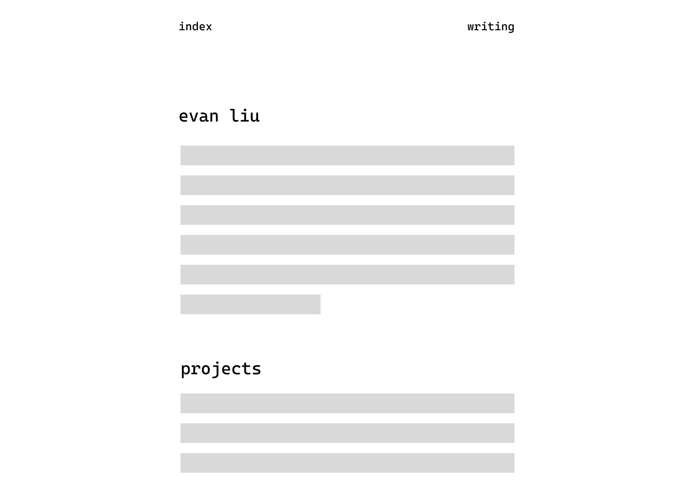
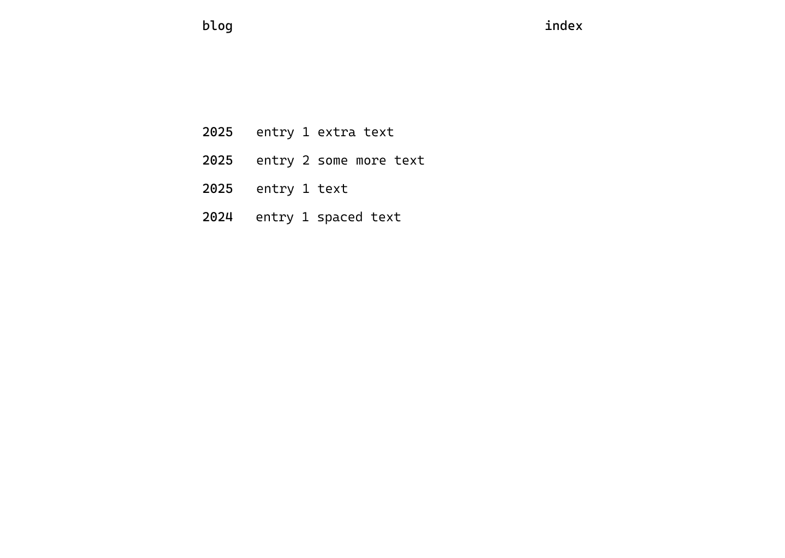
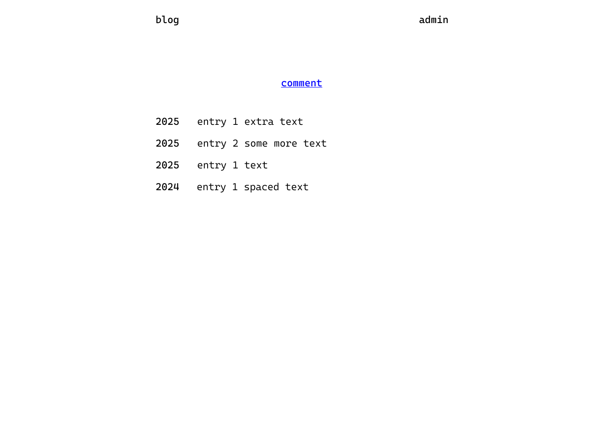
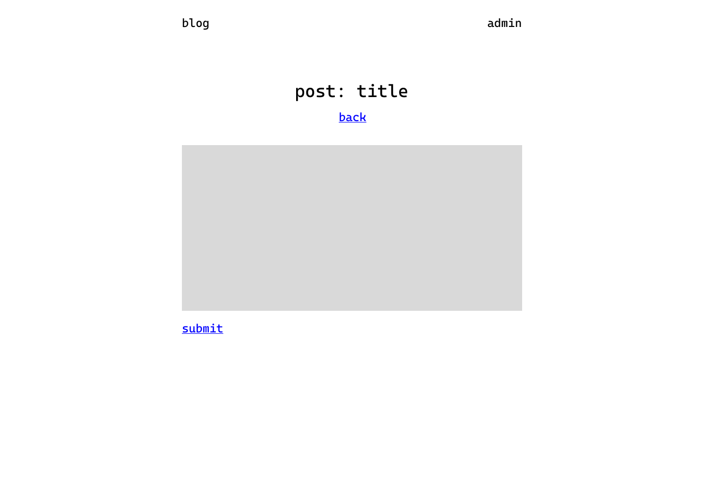
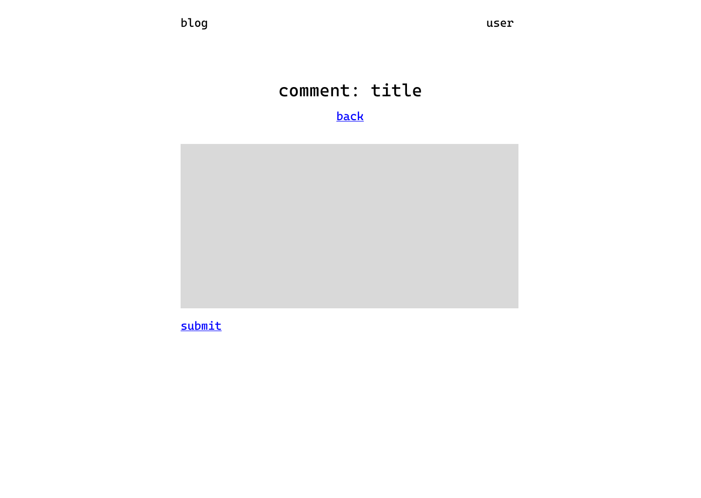
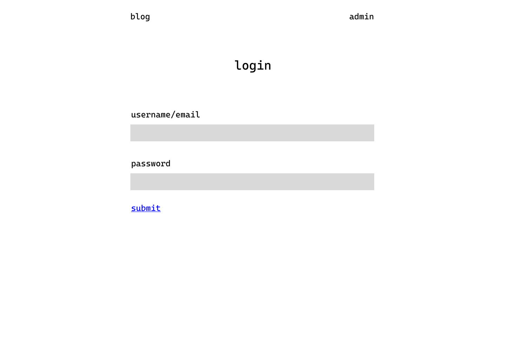
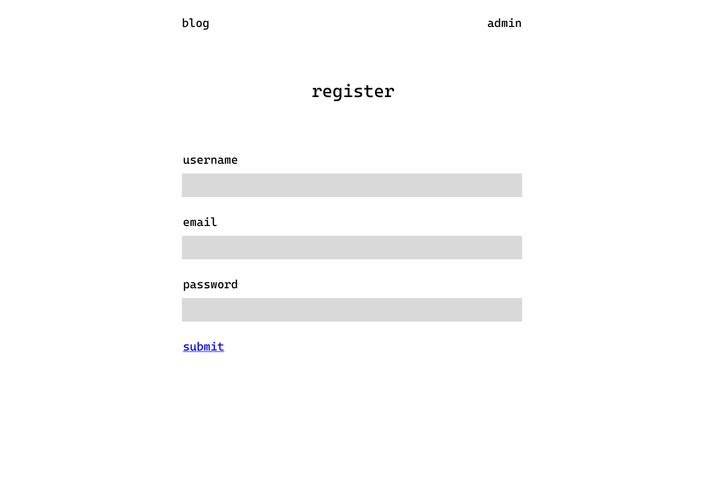

# Personal Website

## Overview

I want to make a personal website for myself. It will exist to host my blog and link to some personal projects I have made or whatever else.

The blog will host blogs and comments to blogs. Users will have the ability to create accounts, comment on blogs, and admins will be able to post blogs.

## Data Model

The application will store Users, Posts and Comments in Supabase (PostgreSQL).

**Relationships:**

- Users can have one of two roles: `admin` or `commenter`
- Admins can create posts and comment on posts
- Commenters can only comment on posts
- Unauthenticated users can view posts and the landing page
- Each post belongs to one user (admin)
- Each comment belongs to one post and one user
- Posts can have many comments (one-to-many relationship)

**Database Tables:**

A `users` table:

```sql
CREATE TABLE users (
  id UUID PRIMARY KEY DEFAULT gen_random_uuid(),
  username VARCHAR(255) UNIQUE NOT NULL,
  email VARCHAR(255) UNIQUE NOT NULL,
  role VARCHAR(50) DEFAULT 'commenter', -- 'admin' or 'commenter'
  created_at TIMESTAMP DEFAULT NOW()
);
```

A `posts` table:

```sql
CREATE TABLE posts (
  id UUID PRIMARY KEY DEFAULT gen_random_uuid(),
  user_id UUID REFERENCES users(id) ON DELETE CASCADE,
  title VARCHAR(255) NOT NULL,
  content TEXT NOT NULL,
  slug VARCHAR(255) UNIQUE NOT NULL,
  published BOOLEAN DEFAULT false,
  created_at TIMESTAMP DEFAULT NOW(),
  updated_at TIMESTAMP DEFAULT NOW()
);
```

A `comments` table:

```sql
CREATE TABLE comments (
  id UUID PRIMARY KEY DEFAULT gen_random_uuid(),
  post_id UUID REFERENCES posts(id) ON DELETE CASCADE,
  user_id UUID REFERENCES users(id) ON DELETE CASCADE,
  content TEXT NOT NULL,
  created_at TIMESTAMP DEFAULT NOW()
);
```

## [Link to Commented First Draft Schema](db.mjs)

(**TODO**: create a first draft of your Schemas in db.mjs and link to it)

## Wireframes

**[View Wireframes on Figma →](https://www.figma.com/design/laWMXR37nHJIxCZVlzNPlI/AIT-Final?node-id=0-1&t=MdZ2jsnrYJeEmEAY-1)**

/ - about me, project links + homepage



/blog - page that lists blog posts (regular user view)



/blog (admin view) - page that lists blog posts with admin controls



/blog/create - page for creating a new blog post (admin only)



/blog/[slug] - page for viewing a blog post


/blog/[slug]/comment - page for commenting on a blog post



/login - login page



/register - register page



## Site map

**[View Sitemap on Figma →](https://www.figma.com/design/laWMXR37nHJIxCZVlzNPlI/AIT-Final?node-id=0-1&t=MdZ2jsnrYJeEmEAY-1)**


## User Stories or Use Cases

1. as an unauthenticated user, I can view the landing page with information about the site and links to my projects
2. as an unauthenticated user, I can view all published blog posts
3. as an unauthenticated user, I can read a specific blog post and its comments
4. as an unauthenticated user, I can register a new account with the site
5. as a registered user, I can log in to the site
6. as a registered user (commenter), I can comment on published blog posts
7. as an admin user, I can create new blog posts
8. as an admin user, I can publish blog posts
9. as an admin user, I can comment on blog posts

## Research Topics

- (5 points) Integrate user authentication
  - I'm going to be using Supabase for user authentication and as my backend, seems like a popular backend, figured I should step out of my confort zone and learn it.
- (6 points) React / Next
  - used React as the frontend framework; wanted to get better at Next. Used Next for SSR, using react as a general frontend framework.

11 points total out of 10 required points

## Project Files

**Frontend (Next.js):** [frontend/app/page.tsx](frontend/app/page.tsx)

**Backend:** [backend/app.mjs](backend/app.mjs)

## Annotations / References Used

1. [Supabase Documentation](https://supabase.com/docs)
2. [Next.js Documentation](https://nextjs.org/docs)
3. [Supabase Authentication Guide](https://supabase.com/docs/guides/auth)
